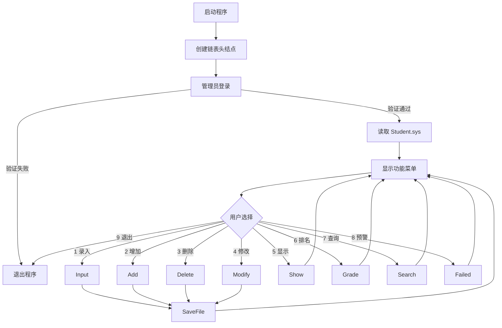

# 系统结构说明

## 设计目标

学生成绩管理系统面向课程设计场景，重点展示 C 语言基础能力：使用结构体描述学生数据，使用单向链表维护运行时数据集合，通过文件读写实现本地持久化，并用菜单驱动方式组织用户操作。

## 核心数据结构

系统在 `main.h` 中定义两个核心结构：

```c
struct student
{
    char number[20];
    char name[50];
    double math;
    double english;
    double cs;
};

struct node
{
    struct student data;
    struct node *next;
};
```

`student` 保存单个学生的学号、姓名和三门课程成绩。`node` 将学生信息包装为链表结点，程序运行时通过带头结点的单向链表完成遍历、插入、删除、修改和排序。

## 模块划分

| 文件 | 职责 |
| --- | --- |
| `main.c` | 创建链表头结点，完成登录校验、读取文件和菜单循环调度。 |
| `Menu Login.c` | 输出控制台菜单，使用 `conio.h` 接收管理员密码。 |
| `Input.c` | 分步骤录入学生基础信息和课程成绩。 |
| `Add.c` | 在链表尾部追加新的学生结点。 |
| `Delete.c` | 按学号查找目标结点并从链表中移除。 |
| `Modify.c` | 按学号定位学生后修改指定字段。 |
| `Show Search.c` | 遍历展示全部学生，或按学号查询单个学生成绩。 |
| `Grade.c` | 对三门课程分别进行冒泡排序并输出排名。 |
| `Failed.c` | 统计每个学生的不及格科目数量并输出名单。 |
| `Save Read.c` | 将链表中的学生数据写入 `Student.sys`，启动时再读取恢复。 |

## 运行流程



## 数据持久化

系统启动时调用 `ReadFile` 读取 `Student.sys`，逐条恢复学生结点。新增、删除、修改和录入成绩后调用 `SaveFile`，将链表中的 `student` 结构体连续写入本地文件。

这种方式实现简单，适合课程设计演示；如果继续扩展，可以进一步改为文本格式、CSV 或 SQLite，便于跨平台查看和维护。

## 可扩展方向

- 增加学号唯一性校验，避免重复录入。
- 将排序结果复制到临时链表，避免排名操作改变原链表顺序。
- 增加总分、平均分、班级排名等统计指标。
- 将管理员密码改为配置文件或加密存储。
- 封装输入校验函数，减少各模块中重复的成绩范围判断逻辑。
